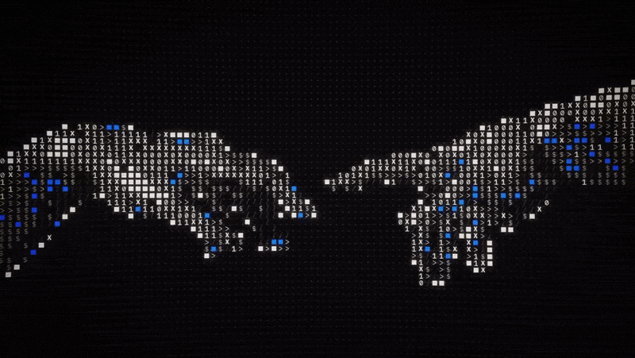

  

<h1 align="center">Hi 👋, I'm Debayan</h1>

<h3 align="center">Software Engineer</h3>

  

  Building reliable backend systems with clean architecture and scalable solutions.

<h2 align="center">🚀 About Me</h2>

Hi, I'm **Debayan** 👋 — a software engineer who loves backend development and building AI-powered products.

I'm drawn to the part of software that happens behind the scenes: well-structured APIs, dependable data pipelines, and systems that stay fast and maintainable as they grow.

### 🔭 What I'm working on
I'm currently building **[Cortex](https://github.com/d3byn/Cortex)**, a document intelligence platform that lets you ask questions over your own documents. It combines hybrid retrieval (semantic + keyword search), reranking, and LLM-powered answers, all served through a FastAPI backend.

### 🌱 What I'm learning
- Retrieval-augmented generation (RAG) and how to make it more accurate
- Building agent-style pipelines with LangGraph
- Designing backend services that are clean, tested, and production-ready

### 🎯 My goal
To write clean code, ship reliable software, and grow into an engineer who builds systems that last.

I'm always happy to chat about backend engineering, AI products, or interesting ideas, so feel free to reach out! 🤝

 

<h2 align="center">🤝 Connect</h2>

  
  

<h2 align="center">💻 Tech Stack</h2>

  
  
  
  
  
  
  
  
  
  
  
  
  
  
  
  
  

<h2 align="center">📊 GitHub Stats</h2>

<h2 align="center">⌘ Commit Activity</h2>

  <picture>
    <source media="(prefers-color-scheme: dark)" srcset="https://raw.githubusercontent.com/d3byn/d3byn/output/pacman-contribution-graph-dark.svg">
    <source media="(prefers-color-scheme: light)" srcset="https://raw.githubusercontent.com/d3byn/d3byn/output/pacman-contribution-graph.svg">
    
  </picture>

